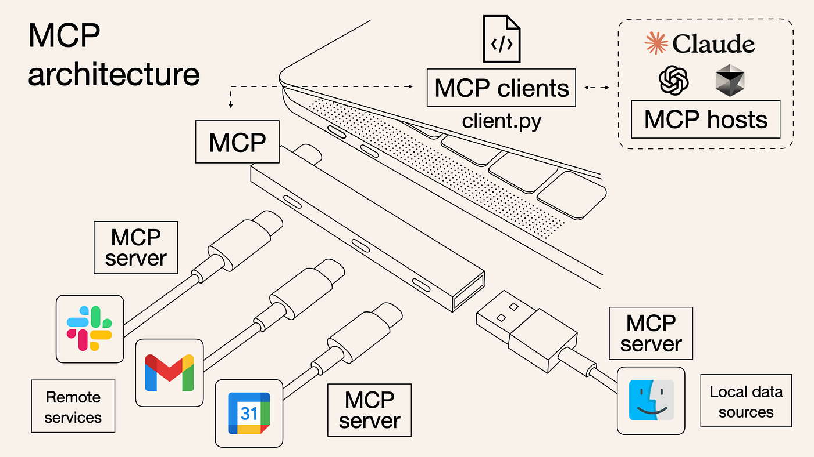
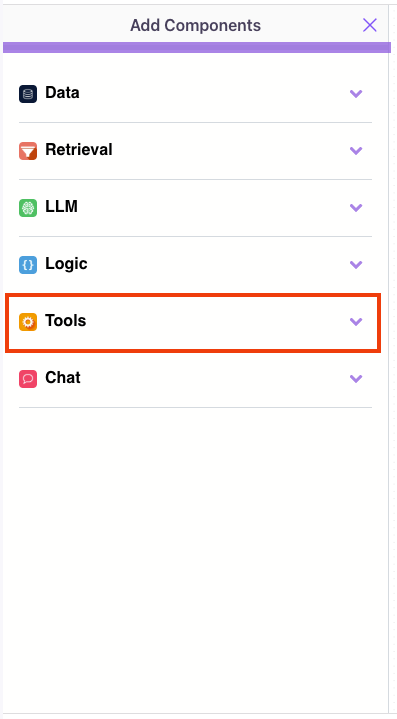
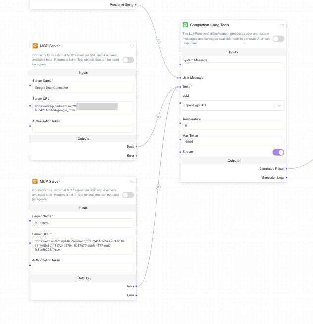

# MCP

**Model Context Protocol (MCP)** is an emerging open standard that enables interoperability between AI agents and external tools through tool-based API interfaces. MCP allows agents to:

* Discover external tools from a registered endpoint.
* Invoke tools (APIs) dynamically based on user intent.
* Register themselves as callable tool servers (like plugins) for other agents/platforms.

<figure><figcaption></figcaption></figure>

Epsilla fully supports both **consuming** external MCP tool servers and **publishing** your own agent as a MCP-compatible tool server.

### Connecting Epsilla Agents to External MCP Servers

To invoke external tools via MCP inside an Epsilla agent workflow, follow these steps:

**1. Use Completion Using Tools**

From the **LLM** section, add the **Completion Using Tools** component.

<figure><figcaption></figcaption></figure>

This component is the core of an AI agent that takes user input, reasons and plans, and takes actions by using available tools.

<figure><figcaption></figcaption></figure>

**2. Add MCP Server Component**

From the **“Add Components”** panel, expand **Tools**, and select **MCP Server**.

<figure><figcaption></figcaption></figure>

<figure><figcaption></figcaption></figure>

**3. Configure MCP Server Connection**

Provide the following fields:

* **Server Name**: Friendly name (e.g., _Google Drive Connector_ or _CES 2025_).
* **Server URL**: The MCP endpoint URL (e.g., `https://mcp.pipedream.net/...`).
* **Authorization Token** (if required): Token needed to access private MCP servers.

<figure><figcaption></figcaption></figure>

**4. Wire the Workflow**

Connect the MCP server's Tools output to the LLM component's Tools input.

<figure><figcaption></figcaption></figure>

The agent will now dynamically select and invoke appropriate external tools via MCP based on user queries.

<figure><figcaption></figcaption></figure>

<figure><figcaption></figcaption></figure>

### Publishing Your Epsilla Agent as an MCP Server

Epsilla allows you to **expose any agent** as an MCP-compatible tool server so it can be used by other platforms (like Cursor, Claude Desktop, and other MCP clients).

Ensure that the access control setting is configured as "Anyone with the link."&#x20;

<figure><figcaption></figcaption></figure>

Once you’ve published your AI agent, you’ll see the **MCP server config** available:

<figure><figcaption></figcaption></figure>

Copy the config snippet and paste it into your target MCP-supported platform (such as Cursor or other compatible apps).

Test the connection to confirm your agent is properly registered and discoverable.

<figure><figcaption></figcaption></figure>

Now, your agent can be called by the other platforms as an extension to their capability.

<figure><figcaption></figcaption></figure>

This integration expands your agent’s reach—letting it operate as part of a **broader AI ecosystem** with minimal setup.

