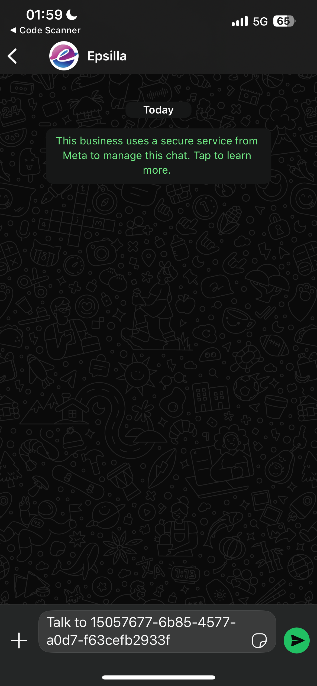
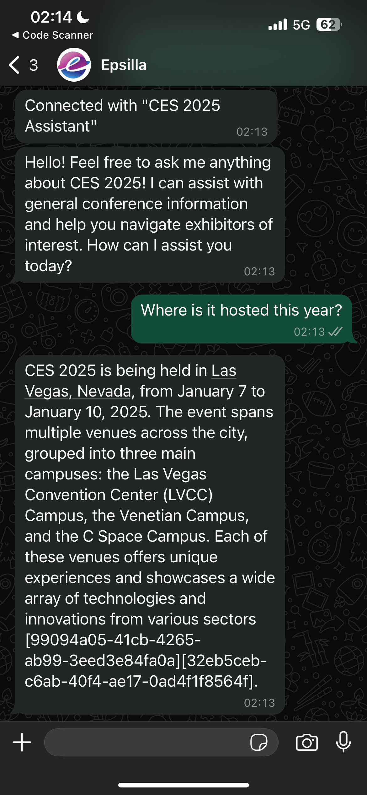

# Publish and Deployment

Once you've built and configured your AI agent on Epsilla's platform, you can easily publish and deploy it for broader usage. The platform provides several options to control access and deploy the agent on different platforms, either as a web component or via API integration. This guide will walk you through the steps of publishing and deploying your AI agent.

<figure><figcaption></figcaption></figure>

### Access Control Configuration

Before publishing your AI agent, you need to decide who will have access to it. The platform allows you to configure access based on your project's needs:

<figure><figcaption></figcaption></figure>

**Access Control Options**:

* **Only people in this project**: Limits access to members within your Epsilla project. This is ideal for internal testing or team-based collaboration.
* **All Epsilla Cloud users**: Allows all registered Epsilla users to access the AI agent. Use this option when you are ready for broader access but still wish to maintain control.
* **Anyone with the link**: Provides unrestricted access to the AI agent to anyone who has the access link. This is useful for sharing with external collaborators or customers.


If you choose the "All Epsilla Cloud users" or "Anyone with the link" option, you'll see a warning: _"Be cautious about your LLM token usage."_ This is a reminder that broader access may lead to higher usage, potentially impacting your usage quotas or incurring additional costs.


<figure><figcaption></figcaption></figure>

### Publish to App Portal

The **Publish to App Portal** feature allows you to make your AI agent publicly available on the Epsilla App Portal, where it can be discovered by a broader audience, including other Epsilla users and potential customers. This can help increase visibility and adoption of your agent, especially if it solves specific use cases that appeal to various industries or communities.

<figure><figcaption></figcaption></figure>

### Access Link Generation

After selecting the appropriate access control and deployment method, an access link for the AI agent is generated. This unique link can be shared based on the access control settings you've chosen.

<figure><figcaption></figcaption></figure>

You can copy or open the link directly using the icons provided next to the link.

### Deployment Options

Once you've configured access, you can proceed to deploy your AI agent. Epsilla offers flexible deployment methods to suit different integration needs.

#### **Add to My Website**

You can embed the AI agent directly on your website by generating and copying an embeddable widget code. This option is ideal for companies looking to offer an interactive AI assistant on your public or private website. Epsilla offers two flexible options for integrating your AI agent into your website:

<figure><figcaption></figcaption></figure>

* **Widget Integration:** The first option allows you to embed the AI agent as a widget, typically placed in the bottom-right corner of your website. This method involves adding a small JavaScript snippet to your website’s HTML, right before the closing `</body>` tag. The widget offers a convenient, interactive interface for users to engage with the AI agent, maintaining a subtle presence while being easily accessible.
* **IFrame Embedding:** The second option is to integrate the AI agent using an iframe. This method involves embedding the agent in a specific part of your website by placing an iframe element in your HTML code. This option provides more control over where the chatbot appears on the page, allowing you to define the size and position of the embedded agent. The iframe creates an isolated environment for the AI agent within your webpage.

**Access via REST API**

For developers looking to integrate the AI agent into their own applications or platforms, Epsilla provides a powerful way to integrate AI agents using its REST API. This approach allows developers to send requests to the AI agent and receive responses programmatically, making it highly flexible for embedding within various application layers, platforms, or services.

<figure><figcaption></figcaption></figure>

For Chatbot agent, the following APIs are provided:

* **Start a new conversation**
* **Chat with a message**
* **Streaming the AI response back**
* **Get the chat history of a conversation**
* **Get all conversations**
* **Delete a conversation**

For Smart Search agent, the following APIs are provided:

* **Start a new search**
* **Streaming the AI search result back**
* **Get a search result**
* **Get all search history**
* **Delete a search**

With the REST API integration, Epsilla enables you to build custom applications leveraging AI capabilities, making it easier to automate interactions, streamline processes, and deliver intelligent responses at scale.

#### **WhatsApp**

To enable WhatsApp access for your Epsilla AI agent, ensure that the access control setting is configured as "Anyone with the link."&#x20;

<figure><figcaption></figcaption></figure>

Once enabled, a QR code will be generated for the WhatsApp access. Share this QR code with your users:

<figure><figcaption></figcaption></figure>

After scanning the QR code, your users need to send a pre-filled message to initiate conversations with your AI agent.

<figure><figcaption></figcaption></figure>

<figure><figcaption></figcaption></figure>

Now, your user is ready to chat with your AI agent on WhatsApp!

<figure><figcaption></figcaption></figure>

This streamlined deployment method makes it easier to reach a broader audience while maintaining an intuitive and accessible communication channel through WhatsApp.

#### **MCP**

Epsilla supports **Model Context Protocol (MCP) integration**, allowing your AI agent to connect seamlessly with other MCP-compatible tools and platforms. This enables your agent to go beyond simple Q\&A—letting it interact with other systems and take real actions.

Ensure that the access control setting is configured as "Anyone with the link."&#x20;

<figure><figcaption></figcaption></figure>

Once you’ve published your AI agent, you’ll see the **MCP server config** available:

<figure><figcaption></figcaption></figure>

Copy the config snippet and paste it into your target MCP-supported platform (such as Cursor or other compatible apps).

Test the connection to confirm your agent is properly registered and discoverable.

<figure><figcaption></figcaption></figure>

Now, your agent can be called by the other platforms as an extension to their capability.

<figure><figcaption></figcaption></figure>

This integration expands your agent’s reach—letting it operate as part of a **broader AI ecosystem** with minimal setup.
