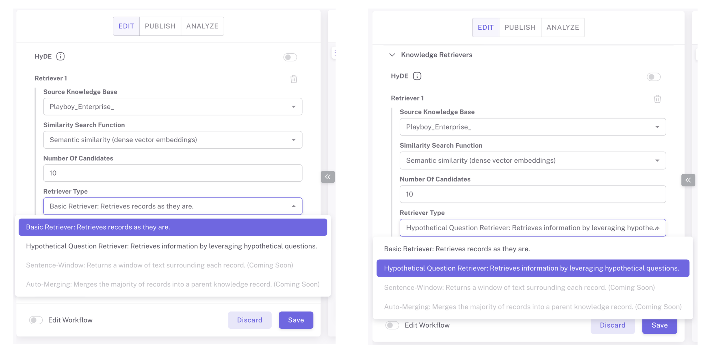

# Hypothetical Questions

**Hypothetical Questions** are questions generated from document chunks using a large language model (LLM). Instead of embedding document chunks directly, these generated questions are embedded and stored with metadata linking them back to the original chunks. When a user asks a query, the system compares the user query embedding with the hypothetical question embeddings to retrieve the most relevant chunks.

This approach addresses a core issue in Retrieval-Augmented Generation (RAG): the misalignment of embeddings between user questions and document content. By embedding hypothetical questions rather than document statements, the system creates embeddings that better align with user queries, significantly improving retrieval precision.

***

### **Enabling Hypothetical Questions in Epsilla**

**Activating the Feature in Data Source Settings:**

* In the **Data Sources** section, toggle the **Hypothetical Questions** option during data loading.
* Epsilla uses its default LLM and prompt for question generation, which can be customized for domain-specific needs.

<figure><figcaption></figcaption></figure>

**Generating Questions During Data Loading:**

* For each chunk of your document, the system generates several hypothetical questions.
* These questions are stored in a dedicated table, linked to the corresponding chunks via a unique ChunkID. This ensures traceability between questions and the original content.

<figure><figcaption></figcaption></figure>

**Adjusting the Retriever:**

* In the **Configuring Advanced Knowledge Retrieval** under [Configuring Knowledge for the Chatbot](../../application/basic-smart-search-agent-config.md#configuring-knowledge-for-the-smart-search-agent), set the retriever type to "Hypothetical Question Retriever" to apply this advanced retrieval strategy.

<figure><figcaption></figcaption></figure>

* Compare the performance of the Hypothetical Question Retriever with the Basic Retriever using Epsilla's evaluation tools to measure metrics like accuracy, relevance, and coverage.

***

### **How Does the Hypothetical Question Workflow Operate?**

The process integrates seamlessly into Epsilla’s retrieval pipeline with the following steps:

1. **Document Chunking:** The original document is split into smaller, manageable chunks.
2. **Hypothetical Question Generation:** For each chunk, LLM-generated questions represent the content.
3. **Embedding Questions:** The hypothetical questions are converted into vector embeddings and stored in the vector database with metadata (e.g., ChunkID).
4. **Processing User Queries:** User queries are embedded and compared with stored question embeddings.
5. **Similarity Search:** The system retrieves the most relevant hypothetical questions.
6. **Retrieving Original Chunks:** Using the metadata, the system identifies and retrieves the original document chunks linked to the top questions.
7. **Generating Responses:** The retrieved chunks serve as context for generating precise and accurate answers.

***

### **Benefits of Hypothetical Questions**

1. **Improved Semantic Alignment:**
   * By comparing user questions with other questions (instead of document chunks), this feature ensures embeddings are in the same semantic space.
   * This alignment significantly improves the precision of similarity searches and retrieval.
2. **Enhanced Retrieval Accuracy:**
   * Misalignment issues caused by varying phrasing and semantics in user queries and document content are minimized.
   * For example, a query like “Does this insurance cover knee surgery?” aligns more naturally with a hypothetical question such as “Is knee surgery covered under this policy?” than with the original document content.
3. **Use Case Flexibility:**
   * This approach works well for various domains, including legal, financial, and technical documents, where the precise alignment of user queries with complex content is critical.
